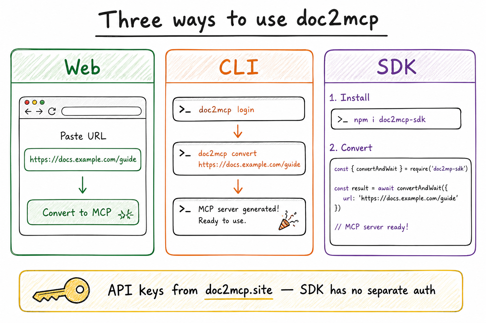
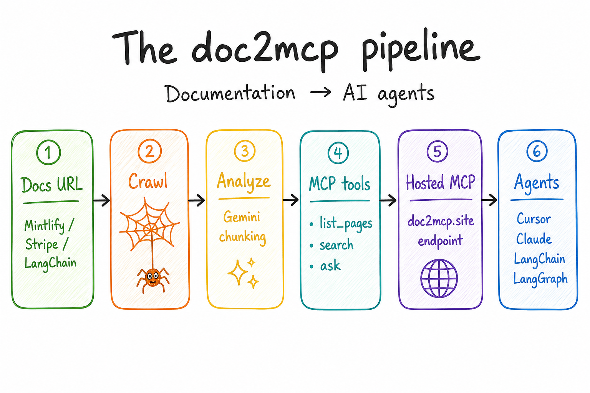
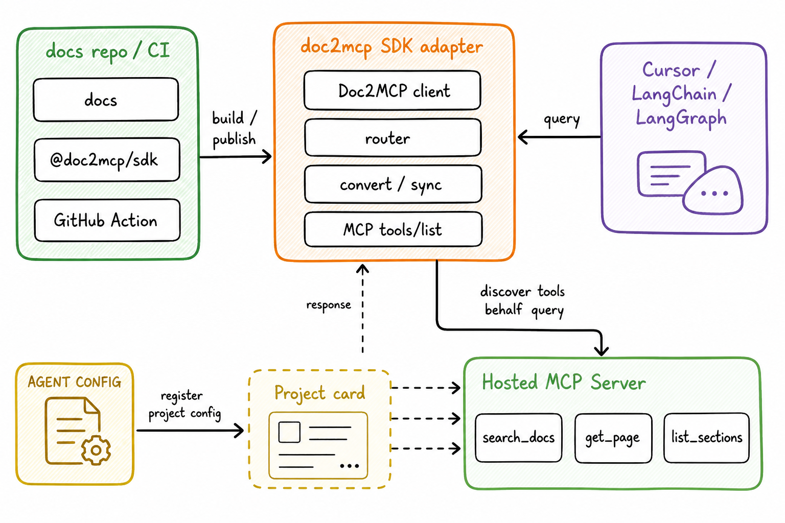

<div align="center">

# doc2mcp

### Documentation infrastructure for AI agents

**Paste any docs URL → get a hosted, Cursor-ready MCP server in under 60 seconds.**

[**Live**](https://doc2mcp.site) · [Docs](https://doc2mcp.site/docs) · [SDK](https://github.com/doc2mcp/doc2mcp-sdk) · [Marketplace](https://doc2mcp.site/marketplace) · [Open Source](https://doc2mcp.site/open-source)

[](https://registry.modelcontextprotocol.io/?search=doc2mcp)
[](https://www.npmjs.com/package/doc2mcp)
[](https://www.npmjs.com/package/doc2mcp-sdk)
[](./LICENSE)
[](https://github.com/doc2mcp/doc2mcp/stargazers)

⭐ **Star this repo** — it helps developers discover doc2mcp on GitHub and the MCP Registry.

</div>

---

## Three ways to use doc2mcp



| Surface | Best for | Start here |
|---------|----------|------------|
| **Web** | Instant convert in the browser | [doc2mcp.site](https://doc2mcp.site) |
| **CLI** | Terminal + one-shot install into Cursor | [`npm i -g doc2mcp`](https://www.npmjs.com/package/doc2mcp) |
| **SDK** | Code, CI, LangChain / LangGraph / agents | [`doc2mcp-sdk`](https://github.com/doc2mcp/doc2mcp-sdk) |

> API keys always come from **doc2mcp.site** (User PAT + project token). The SDK has **no separate login**.

---

## The pipeline



Docs URL → crawl → analyze → MCP tools → hosted endpoint → Cursor / Claude / LangChain / LangGraph.

---

### 1) Web (normal)

1. Sign in at [doc2mcp.site/login](https://doc2mcp.site/login)
2. Paste a docs URL (Stripe, LangChain, Mintlify, GitHub…)
3. Copy the hosted MCP URL + Bearer token into Cursor / Claude / VS Code

```json
{
  "mcpServers": {
    "my-docs": {
      "url": "https://doc2mcp.site/api/mcp/{project_id}/mcp",
      "headers": { "Authorization": "Bearer <project-token>" }
    }
  }
}
```

---

### 2) CLI

```bash
npm install -g doc2mcp
doc2mcp login                 # creates User PAT (d2mcp_pat_…)
doc2mcp https://docs.example.com
```

Lists the same projects as the dashboard. Install helpers for Cursor / VS Code / Claude / Windsurf.

---

### 3) SDK (`doc2mcp-sdk`)



```bash
npm i doc2mcp-sdk
```

```ts
import { Doc2MCP } from "doc2mcp-sdk";

// User PAT from doc2mcp.site / `npx doc2mcp login` — SDK has no auth of its own
const client = new Doc2MCP({ token: process.env.DOC2MCP_PAT! });

const ready = await client.convertAndWait({
  sourceUrl: "https://js.langchain.com/docs",
});

const answer = await client.callToolText({
  mcpUrl: ready.mcp.url,
  mcpToken: ready.mcp.token, // project token d2mcp_…
  name: "search_documentation",
  arguments: { query: "how do runnables work?" },
});
```

Full handbook (API keys, Cursor, Claude, LangChain, LangGraph, LangSmith, OpenAI, Vercel AI SDK, CrewAI, AutoGen, Mastra):

**[doc2mcp/doc2mcp-sdk → docs/](https://github.com/doc2mcp/doc2mcp-sdk/tree/main/docs)**

Product docs page: [doc2mcp.site/docs/sdk](https://doc2mcp.site/docs/sdk)

---

## MCP tools generated per project

| Tool | What it does |
|------|--------------|
| `list_documentation_pages` | Every crawled page |
| `get_documentation_page` | Full markdown of one page |
| `search_documentation` | Heading-aware search |
| `get_documentation_overview` | Summary + index |
| `read_full_documentation` | All pages combined |
| `ask_documentation` | Q&A with citations |

## Repos

| Repo | Purpose |
|------|---------|
| **[doc2mcp/doc2mcp](https://github.com/doc2mcp/doc2mcp)** (this) | Next.js app, CLI, pipeline, MCP runtime |
| **[doc2mcp/doc2mcp-sdk](https://github.com/doc2mcp/doc2mcp-sdk)** | Programmatic JS/TS SDK + framework examples |
| **[doc2mcp/doc2mcp-registry](https://github.com/doc2mcp/doc2mcp-registry)** | MCP Registry gateway manifest |

## Contribute

1. Read [CONTRIBUTING.md](./CONTRIBUTING.md) and [CODE_OF_CONDUCT.md](./CODE_OF_CONDUCT.md)
2. Branch from `staging` → open PR → `staging`
3. AI review (`Gemini PR review`) **fails the check on must-fix** — fix blockers before merge
4. Coupon **`opensourcedoc2mcp`** → Starter free for 12 months on [Pricing](https://doc2mcp.site/pricing)

More: [doc2mcp.site/open-source](https://doc2mcp.site/open-source)

## Local development

```bash
pnpm install
cp .env.example .env.local
pnpm dev
```

```bash
pnpm check
pnpm exec tsc --noEmit --skipLibCheck
```

## CI / CD

Feature → `staging` (preview) → `main` → `v*` tag deploys production on Vercel.

PR checks: Biome/Ultracite, TypeScript, Next build, CLI build, **Gemini AI review** (must-fix → failed check).

## License

MIT — see [LICENSE](./LICENSE).
